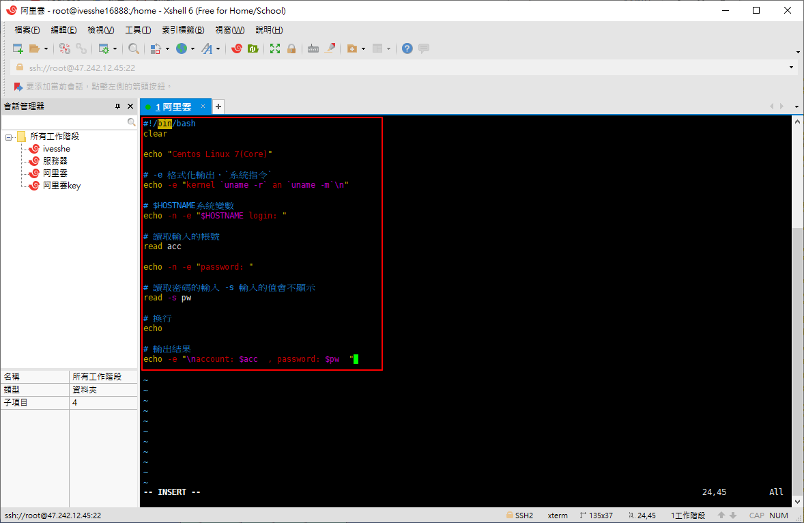
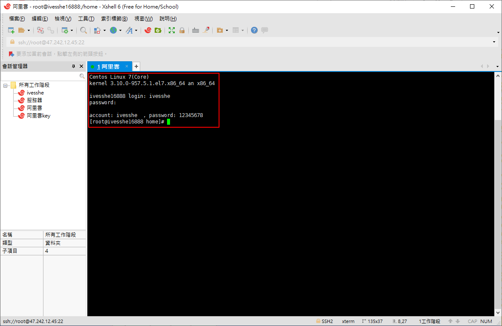

# Shell Script Study
很簡單的練習，以後要用到深入，再回頭學習

login.sh
```shell
#!/bin/bash
clear

echo "Centos Linux 7(Core)"

# -e 格式化輸出，`系統指令`
echo -e "kernel `uname -r` an `uname -m`\n"

# $HOSTNAME系統變數
echo -n -e "$HOSTNAME login: "

# 讀取輸入的帳號
read acc

echo -n -e "password: "

# 讀取密碼的輸入 -s 輸入的值會不顯示
read -s pw

# 換行
echo

# 輸出結果
echo -e "\naccount: $acc  , password: $pw  "
```

# 執行結果

```shell
bash login.sh
```




